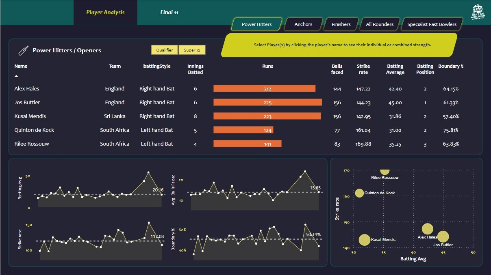

# Cricket-Data-Analytics
Developed a dashboard using Power BI. 

We have used cricket T20 world cup (2022) data to build insights on a best 11 players team that will be unbeatable. We used bright data web scraping to collect data from espncricinfo website, and then we performed some data transformation and cleaning in pandas, followed by building dashboards in Power BI.

&nbsp; <!-- This creates some space -->

